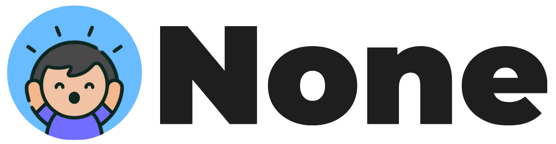

  

# None - Simple Communication for Non-Verbal People

A Multiplatform AAC (Augmentative and Alternative Communication) app. Free and open source, forever.

**Website**: [https://noneapp.org](https://noneapp.org)

## What is None?

None helps non-verbal people communicate through customizable boards with images and audio. Simple, effective, and always free.

## Features

- Customizable buttons with images and audio
- Built-in audio recording for personalized sounds
- Camera and gallery support for button images
- Works offline - no internet required
- Optional cloud sync across devices
- Clean, distraction-free interface
- Multi-language support (ES, EN, FR, PT, DE, AR, IT, JA, ZH)
- Available on Android and iOS

## Download

- **Android**: [Google Play Store](https://play.google.com/store) (coming soon)
- **iOS**: [App Store](https://apps.apple.com) (coming soon)

## For Developers

Want to contribute or build from source? See [DEVELOPERS.md](DEVELOPERS.md) for technical documentation.

## License

GNU GPL v3 - Free and open source forever.

**Copyright © 2024-2025 Guillermo Quinteros**

Named in honor of Salvador "None" Quinteros.

## Contact

- Email: gu.quinteros@gmail.com
- Website: [https://noneapp.org](https://noneapp.org)
- GitHub: [github.com/gmoqa/none](https://github.com/gmoqa/none)

---
